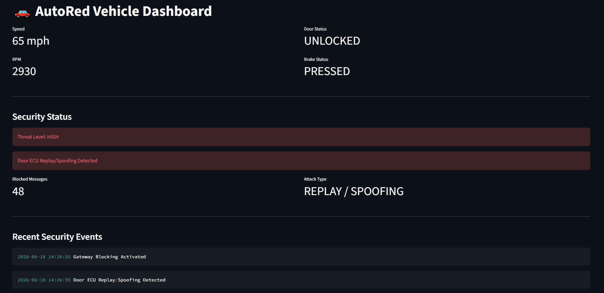
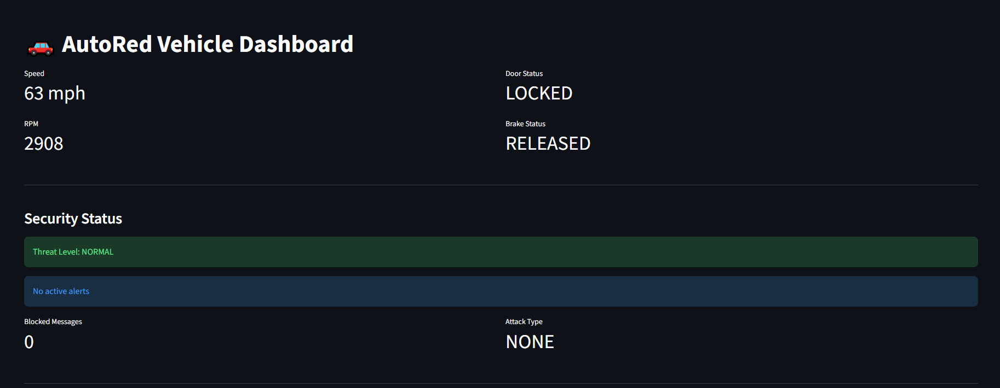
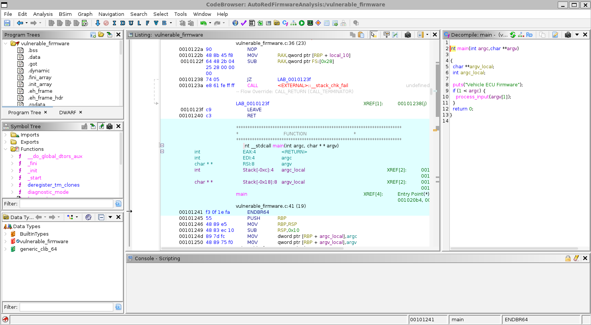
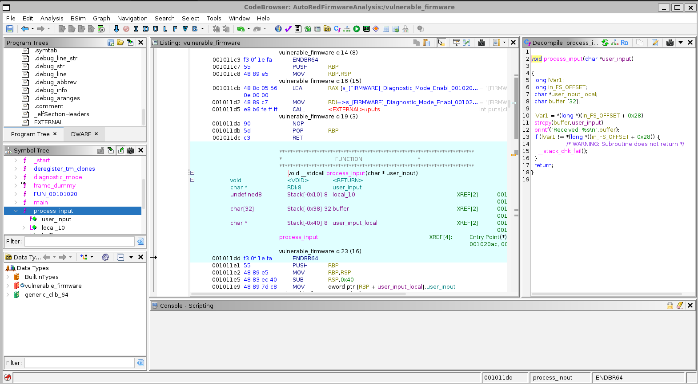
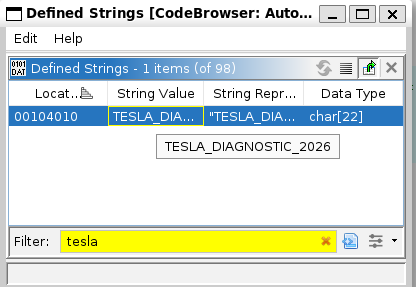

# 🚗 AutoRed: Automotive Red Team & Vehicle Security Platform




## Overview

AutoRed is a vehicle security testing and research platform built to simulate modern automotive attack and defense scenarios.

The project combines:

- Multi-ECU vehicle simulation
- CAN bus communication
- Offensive security testing
- Intrusion detection and prevention
- Security monitoring
- Embedded software development
- Firmware reverse engineering

AutoRed was developed to demonstrate the skills commonly required for Automotive Security Engineering and Vehicle Software Red Team roles.

---

# Features

## Vehicle Simulation

Simulated Electronic Control Units (ECUs):

- Engine ECU
- Door ECU
- Brake ECU
- Gateway ECU

Communication occurs over a virtual CAN network using SocketCAN (`vcan0`).

---

## Offensive Security

### CAN Spoofing Attack

Inject malicious CAN messages onto the vehicle network.

Examples:

- Unauthorized door unlock commands
- ECU impersonation
- Malicious frame injection

### CAN Replay Attack

Capture legitimate CAN traffic and replay it later.

Capabilities:

- Traffic capture
- Frame parsing
- Message replay
- Gateway detection

---

## Defensive Security

### Gateway ECU

The Gateway ECU monitors CAN traffic and performs:

- Message inspection
- Threat detection
- Traffic filtering
- Security event generation

### Intrusion Detection System (IDS)

Detects:

- Excessive Door ECU activity
- Potential CAN spoofing attacks
- Replay attack behavior

### Intrusion Prevention System (IPS)

Automatically:

- Blocks suspicious CAN traffic
- Records security events
- Escalates threat levels

---

## Security Monitoring Dashboard

Real-time dashboard built with Streamlit.

Displays:

- Vehicle telemetry
- Threat level
- Active alerts
- Attack type
- Blocked messages
- Security event timeline

---

## Embedded Security

### Native C Engine ECU

The Engine ECU was implemented in C using Linux SocketCAN.

Technologies:

- C
- GCC
- Linux CAN Sockets
- SocketCAN

This demonstrates low-level automotive software development and CAN frame generation.

---

## Firmware Security

### x86 Firmware Analysis

Created a vulnerable ECU firmware image and performed:

- Static analysis
- Symbol extraction
- Secret discovery
- Vulnerability assessment

### ARM Firmware Analysis

Cross-compiled firmware for ARM using:

- arm-linux-gnueabi-gcc

Performed architecture comparison and firmware inspection.

---

## Reverse Engineering

Performed firmware reverse engineering using:

- Ghidra
- strings
- nm

Recovered:

- `main()`
- `process_input()`
- `unlock_doors()`
- `diagnostic_mode()`

Identified:

- Hardcoded secrets
- Unsafe memory operations
- Dormant functionality
- Debug metadata exposure

---

# Architecture

```text
                    +------------------+
                    |  Engine ECU (C)  |
                    +------------------+
                              |
                    +------------------+
                    |   Door ECU       |
                    +------------------+
                              |
                    +------------------+
                    |   Brake ECU      |
                    +------------------+
                              |
                              v

                       SocketCAN
                         vcan0
                              |
                              v

                    +------------------+
                    |   Gateway ECU    |
                    +------------------+
                              |
            +-----------------+-----------------+
            |                                   |
            v                                   v

    Intrusion Detection                Intrusion Prevention
            |                                   |
            +---------------+-------------------+
                            |
                            v

                    Security Logging
                            |
                            v

                    Streamlit Dashboard
```

---


# Technologies Used

## Programming Languages

- Python
- C

## Automotive

- CAN Bus
- SocketCAN
- vcan

## Offensive Security

- CAN Spoofing
- CAN Replay
- Threat Emulation

## Defensive Security

- IDS
- IPS
- Security Monitoring

## Embedded Systems

- GCC
- ARM Cross Compilation
- Linux CAN Sockets

## Reverse Engineering

- Ghidra
- strings
- nm

## Dashboard

- Streamlit

---

# Security Findings

## Hardcoded Secret

```text
TESLA_DIAGNOSTIC_2026
```

### Risk

An attacker extracting firmware could recover embedded secrets and potentially gain access to diagnostic functionality.

---

## Unsafe Memory Operation

```c
strcpy(buffer, user_input);
```

### Risk

Potential stack-based buffer overflow leading to memory corruption or arbitrary code execution.

---

## Dormant Functionality

Recovered functions:

- `unlock_doors()`
- `diagnostic_mode()`

### Risk

Hidden functionality increases attack surface and may expose undocumented capabilities.

---

## Debug Metadata Exposure

Recovered:

- Function names
- Source file names
- Build information

### Risk

Reduces reverse engineering effort and exposes implementation details.

---

# Screenshots

## Dashboard



## Attack Detection


## Ghidra Symbol Tree



## Ghidra Process Input Analysis



## Ghidra Secret Extraction



---

# Learning Objectives

This project demonstrates:

- Automotive Security
- Vehicle Network Security
- CAN Bus Analysis
- Embedded Software Development
- Firmware Reverse Engineering
- Red Team Methodologies
- Security Monitoring
- Intrusion Detection and Prevention

---

# Future Enhancements

- ECU fuzzing
- CAN message authentication
- Secure OTA simulation
- UDS diagnostics
- Automotive threat modeling
- Hardware CAN integration

---

# Author

**Samartha Suresh**
